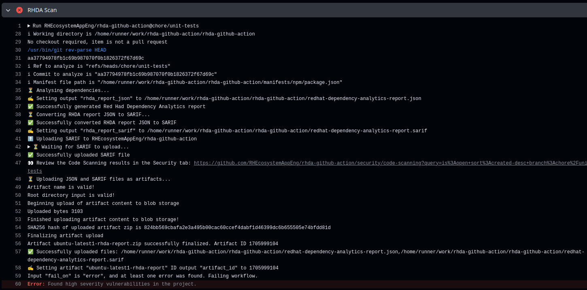
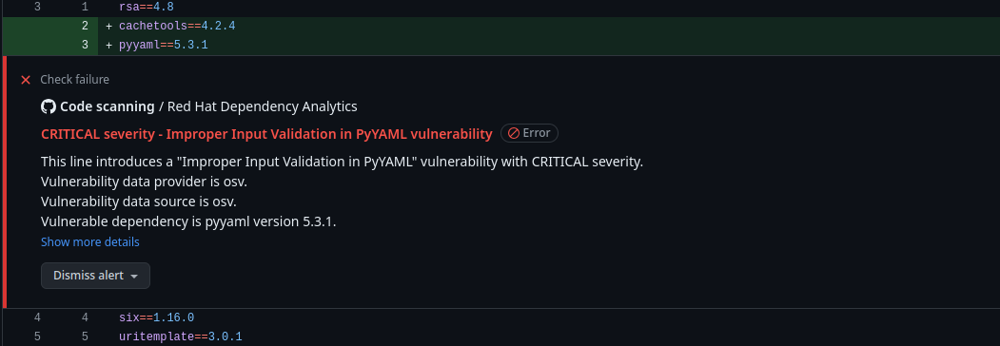

# Red Hat Dependency Analytics

[](https://github.com/RHEcosystemAppEng/rhda-github-action/actions/workflows/ci.yaml)
<br>
<br>
[](https://github.com/RHEcosystemAppEng/rhda-github-action/actions/workflows/scan_maven.yaml)
[](https://github.com/RHEcosystemAppEng/rhda-github-action/actions/workflows/scan_gradle.yaml)
[](https://github.com/RHEcosystemAppEng/rhda-github-action/actions/workflows/scan_npm.yaml)
[](https://github.com/RHEcosystemAppEng/rhda-github-action/actions/workflows/scan_go.yaml)
[](https://github.com/RHEcosystemAppEng/rhda-github-action/actions/workflows/scan_python.yaml)
[](https://github.com/RHEcosystemAppEng/rhda-github-action/actions/workflows/scan_docker.yaml)
[](https://github.com/RHEcosystemAppEng/rhda-github-action/actions/workflows/scan_podman.yaml)
<br>
<br>
[](https://github.com/RHEcosystemAppEng/rhda-github-action/tags)
[](./LICENSE)
[](./dist)

Red Hat Dependency Analytics (RHDA) Github Actions gives you awareness to security concerns when doing code commits to your GitHub repository.
The RHDA platform uses vulnerability data sources to report the most up-to-date vulnerability information available.

Dependency Analytics uploads a report to the GitHub repository as an artifact, and as a [SARIF](https://sarifweb.azurewebsites.net/) file.
Repository maintainers can find discovered vulnerabilities on the **Security** tab.

## Supported ecosystems

| Ecosystem | Required Binaries and Prerequisites | Supported Manifests / Files |
| --------- | ----------------------------------- | --------------------------- |
| <a href="https://www.java.com/">Java</a> - <a href="https://maven.apache.org/">Maven</a> | `mvn` | `pom.xml` |
| <a href="https://gradle.org//">Gradle</a> - <a href="https://gradle.org/install//">Gradle Installation</a> | `gradle` | `build.gradle` |
| <a href="https://www.javascript.com//">JavaScript</a> - <a href="https://www.npmjs.com//">Npm</a> | `npm` | `package.json` |
| <a href="https://go.dev//">Golang</a> - <a href="https://go.dev/blog/using-go-modules//">Go Modules</a> | `go` | `go.mod` |
| <a href="https://go.dev//">Python</a> - <a href="https://pypi.org/project/pip//">pip Installer</a> | `pip` | `requirements.txt` |
| [docker](https://docs.docker.com/get-docker/) | [`syft`](https://github.com/anchore/syft?tab=readme-ov-file#installation),[`skopeo`](https://github.com/containers/skopeo/blob/main/install.md), Java version 20 or later | Dockerfile |
| [Podman](https://podman.io/docs/installation) | [`syft`](https://github.com/anchore/syft?tab=readme-ov-file#installation),[`skopeo`](https://github.com/containers/skopeo/blob/main/install.md), Java version 20 or later | Containerfile |

In future releases, Red Hat plans to support other programming languages.

## Configuring RHDA GitHub Action

You can configure GitHub Actions to use RHDA for your coding environment.
You can see [examples of scanning](./.github/workflows) for each supported language, or you can use the example below.

* GitHub Actions for your environment:
  - [Go](https://github.com/actions/setup-go)
  - [Java](https://github.com/actions/setup-java)
  - [Node.js](https://github.com/actions/setup-node)
  - [Python](https://github.com/actions/setup-python)
  - For `syft` you can use the following script:
    ```yaml
    - name: Setup syft
      run: |
        curl -sSfL https://raw.githubusercontent.com/anchore/syft/main/install.sh | sh -s -- -b /usr/local/bin
    ```
  - For `skopeo` you can use the following script:
    ```yaml
    - name: Setup skopeo
      run: |
        sudo apt-get -y update
        sudo apt-get -y install skopeo
    ```

**Procedure**

1. Add the RHDA scanner to your project's GitHub Actions configuration:
   ```yaml
   - name: RHDA Scan
     id: rhda_scan
     uses: RHEcosystemAppEng/rhda-github-action@main
   ```

**Example**

This Node.js example shows you how to use the RHDA scanner, and uploading the results to GitHub.

```yaml
steps:
    - name: Checkout repository
      uses: actions/checkout@v4

    - name: Setup Node.js
      uses: actions/setup-node@v4
      with:
        node-version: 20
    
    - name: RHDA Scan
      id: rhda_scan
      uses: RHEcosystemAppEng/rhda-github-action@main
```

An example screenshot of a Node.js RHDA scan:


## Action Inputs

| Input | Description | Default |
| ----- | ----------- | --------- |
| `manifest_directory` | Path to the directory containing the `manifest_file`. | 
| `manifest_file` | Name (`basename`) of the manifest file to analyze. This file must exist in the `manifest_directory`. | 
| `rhda_report_name` | The saved file name of the Red Hat Dependency Analytics report. | `redhat-dependency-analytics-report`
| `github_token` | GitHub token to upload a SARIF file to the GitHub. | [`${{ github.token }}`](https://docs.github.com/en/actions/reference/authentication-in-a-workflow#about-the-github_token-secret) <!-- markdown-link-check-disable-line -->
| `upload_sarif` | Upload the generated SARIF file. The default is `true`. If you do not want to upload a SARIF file, then set the input to `false`. | `true`
| `upload_artifact` | Upload the generated RHDA report JSON file and SARIF file as an artifact. | `true`
| `artifact_filename` | File name of the artifact to upload. The default name is, `redhat-dependency-analytics-report`.| `redhat-dependency-analytics-report`
| `fail_on` | A found vulnerability fails the workflow within the project. To fail the workflow when the vulnerability severity level is either `error` or `warning`, set this to `warning`. The default severity level is `error`. If you do not want to fail the action set this input to `never`. | `error`
| `use_python_virtual_environment` | Automates the installation of missing packages in a Python virtual environment when set to true. | `false`
| `use_go_mvs` | Use the Minimal Version Selection (MVS) algorithm to select a set of module versions to use when building Go packages. | `false`
| `enable_python_best_efforts_installation` | Installs Python packages tailored to the Python version in use, disregarding declared versions. This requires setting the `Match Manifest Versions` option to `false`, and the `Use Python Virtual Environment` option to `true`. | `false`
| `use_pip_dep_tree` | Use lightweight `pipdeptree` command line tool as the data source for building the Python dependency tree. This might significantly enhance analysis time. | `false`
| `match_manifest_version` | Restricts RHDA from performing analysis on dependency tags that do not match the tags requested within the manifest files. |  `false`
| `mvn_executable_path` | Specifies absolute path of `mvn` binary. | `mvn` 
| `gradle_executable_path` | Specifies absolute path of `gradle` binary. | `gradle`
| `npm_executable_path` | Specifies absolute path of `npm` binary. | `npm`
| `go_executable_path` | Specifies absolute path of `go` binary. | `go`
| `python3_executable_path` | Specifies absolute path of `python3` binary, `python3` takes precedence over `python`. | `python3`
| `pip3_executable_path` | Specifies absolute path of `pip3` binary, `pip3` takes precedence over `pip`. | `pip3`
| `python_executable_path` | Specifies absolute path of `python` binary, `python3` takes precedence over `python`. | `python`
| `pip_executable_path` | Specifies absolute path of `pip` binary, `pip3` takes precedence over `pip`. | `pip`
| `syft_executable_path` | Specifies absolute path of `syft` binary. | `syft`
| `syft_config_path` | Specifies absolute path to the Syft configuration file. | 
| `skopeo_executable_path` | Specifies absolute path of `skopeo` binary. | `skopeo`
| `skopeo_config_path` | Specifies absolute path to the authentication file used by `skopeo inspect`. | 
| `docker_executable_path` | Specifies absolute path of `docker` binary. | `docker`
| `podman_executable_path` | Specifies absolute path of `podman` binary. | `podman`
| `image_platform` | Specifies platform used for multi-arch images. |

## Action Outputs

- **rhda_report_json**: Path to the generated Red Hat Dependency Analytics report in JSON format.
- **rhda_report_sarif**: Path to the generated Red Hat Dependency Analytics report in SARIF format.
- **artifact_id**: The identifier of the uploaded artifact.

## Scanning Pull Requests

<br >This action can also run RHDA scans on pull requests.
Because the action must check out the pull request's code to scan it, you must use a [`pull_request_target` trigger](https://docs.github.com/en/actions/reference/events-that-trigger-workflows#pull_request_target).

<br >After the workflow runs, and labels the scanning results to the pull request.

The following screenshot shows vulnerability details in the GitHub UI for a pull request.


Use the following snippet to enable pull request scans in your repository:

``` yaml
on:
  pull_request_target:
    # These types are all required for RHDA to scan pull requests correctly and securely.
    types: [ opened, synchronize, reopened, labeled, edited ]
```
